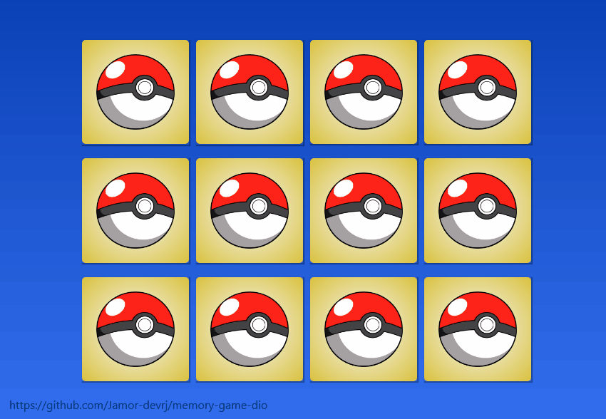

# Desafio Jogo da Memória DIO - TQI Bootcamp :video_game: :brain:
### :rocket: *Jogo da memória em JavaScript - estilo Pokemon* :dragon_face:

No modulo de JavaScript tivemos o desafio para criar um jogo da memória usando
ferramentas no CSS e JavaScrip

### Aprendi: :monocle_face: :man_astronaut:
* Sobre o efeito 3d e o comando flip para virar a carta.
* Efeito na hora de clica a carta.
* Sobreposição de imagens.
* Background nas cartas.
* Função Shufle para mudar as cartas de posição.
* Funções (add, remove, floo etc).
* Impedir de clicar e virar mais de duas cartas.

### Mudei umas coisinhas: :see_no_evil: :zany_face:

* Troquei o fundo das cartas, da frente e do verso.
* Coloquei um gradiente no body.

### O que eu mudaria: :bulb:

* Adcionaria um botão de reset.
* Coloquei um gradiente no body.
* Adcionar no head e no footer logo e contatos.
* Som para animar e um botão de liga/desliga.
* Adptar para celular.

